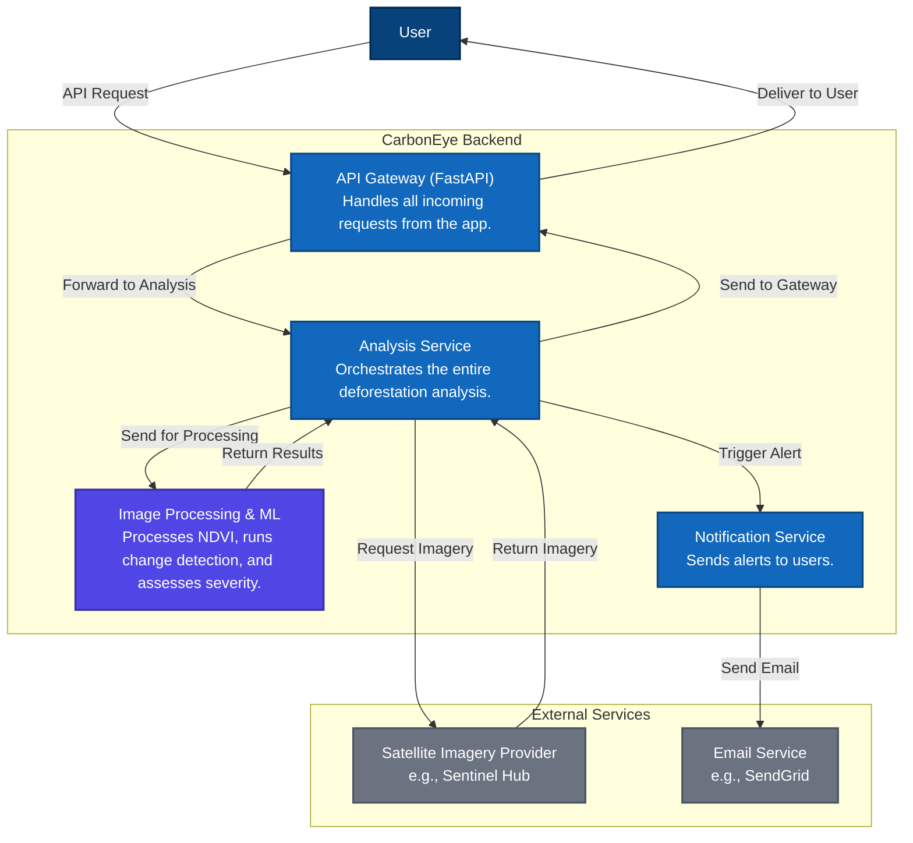

# CarbonEye 🛰️🌳

**Eyes on the forest. Always.**

CarbonEye is a cross-platform mobile application built with Flutter that provides real-time intelligence on deforestation activities across the globe. By leveraging satellite imagery analysis, it empowers users to monitor specific regions, receive timely alerts, and generate detailed impact reports for environmental, social, and governance (ESG) purposes.

## Key Features

-   **Real-time Deforestation Analysis**: Select any region of interest—either from a predefined list of global hotspots or by drawing a custom area on the map—and run an on-demand analysis to detect changes in forest cover.
-   **Interactive Map Interface**: Visualize deforestation events directly on an interactive map. The app supports multiple map layers, including Satellite, Political, and a custom Heatmap view to quickly identify areas with significant activity.
-   **Watchlist & Annotations**: Create a personalized watchlist of regions to monitor closely. Add time-stamped notes and annotations to any region to keep track of observations and important details.
-   **Advanced Alerting System**: Receive detailed alerts for detected deforestation events, categorized by severity (Critical, High, Medium). Review all alerts in a centralized dashboard.
-   **Satellite Image Comparison**: View before-and-after satellite images of an analyzed region to visually confirm and understand the extent of deforestation.
-   **Comprehensive PDF Reporting**: Generate, print, and share professional PDF reports for any monitored region. These reports are ideal for ESG analysis, stakeholder communication, and impact assessment.

### CarbonEye Backend Architecture

    

## Tech Stack & Dependencies

-   **Framework**: [Flutter](https://flutter.dev/)
-   **State Management**: [Flutter Riverpod](https://riverpod.dev/)
-   **Mapping**: [flutter_map](https://pub.dev/packages/flutter_map) with [latlong2](https://pub.dev/packages/latlong2)
-   **Backend Communication**: [http](https://pub.dev/packages/http)
-   **PDF Generation & Printing**: [pdf](https://pub.dev/packages/pdf) & [printing](https://pub.dev/packages/printing)
-   **UI & Animations**: [flutter_animate](https://pub.dev/packages/flutter_animate), [google_fonts](https://pub.dev/packages/google_fonts)
-   **Local Notifications**: [flutter_local_notifications](https://pub.dev/packages/flutter_local_notifications)
-   **File & Path Management**: [path_provider](https://pub.dev/packages/path_provider)
-   **Sharing**: [share_plus](https://pub.dev/packages/share_plus)

